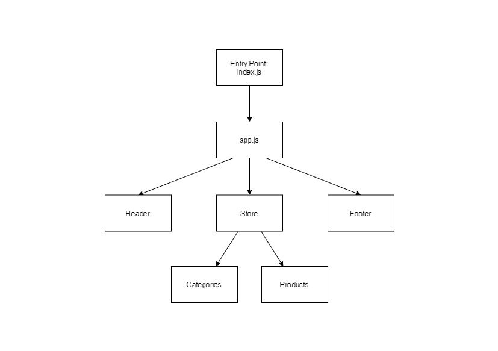

# LAB - Application State with Redux

- **Virtual Store Phase 1:** For this assignment, you will be starting the process of creating an e-Commerce storefront using React with Redux, coupled with your live API server

### **Author:** Afnan Damra
### **Version:** 1.0.0

**Links:**

- [Repo Link](https://github.com/afnandamra/storefront)
- [Deployed Site](https://ad-storefront-401.netlify.app/)
- [PR Link](https://github.com/afnandamra/storefront/pull/1)

## Documentation

### UML Diagram

## Resources

- [Redux docs](https://redux.js.org/introduction/getting-started)
- [Material-UI docs](https://material-ui.com/)
- [Material-UI template](https://material-ui.com/getting-started/templates/album/)

