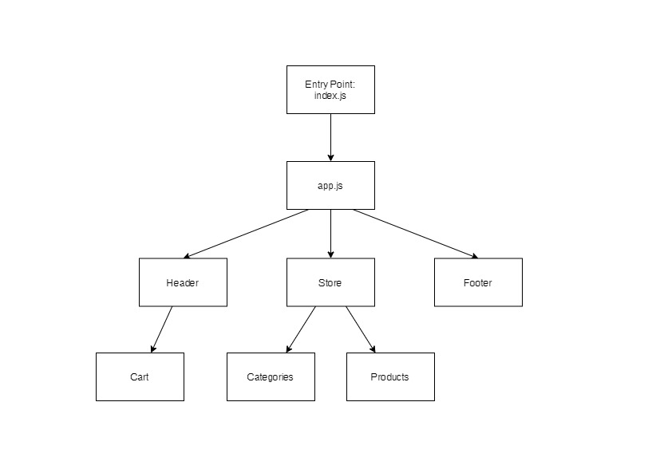

# Lab: Redux - Combined Reducers

- **Virtual Store Phase 2:** Continue work on the e-Commerce storefront, breaking up the store into multiple reducers and sharing functionality/data between components

### **Author:** Afnan Damra
### **Version:** 1.1.0

**Links:**

- [Repo Link](https://github.com/afnandamra/storefront)
- [Deployed Site](https://ad-storefront-401.netlify.app/)
- [PR Link](https://github.com/afnandamra/storefront/pull/2)

## Documentation

### UML Diagram

## Resources

- [Redux docs](https://redux.js.org/introduction/getting-started)
- [Material-UI docs](https://material-ui.com/)
- [Material-UI template](https://material-ui.com/getting-started/templates/album/)

